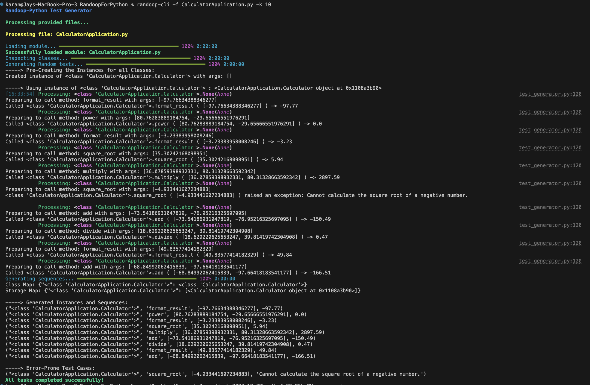

### Randoop-Style Test Generator for Python Classes

---

#### **Overview**

This project implements a Python-based tool for generating **Randoop-style tests**. Randoop is a unit test generation framework that automatically creates test cases by exploring possible sequences of method invocations for classes. This project aims to replicate the core functionality of Randoop by generating sequences of method calls for Python classes, handling edge cases, and writing regression tests for successful test sequences.

With features like **dynamic method inspection**, **random data generation**, and **error handling for invalid cases**, this tool is ideal for automating the testing process in Python.


---

### **Features**

- **Automatic Method Inspection**: Dynamically inspects and identifies all methods within a class, including their parameters.
- **Randomized Test Generation**: Generates sequences of method calls with randomly generated valid arguments.
- **Error-Prone Case Logging**: Captures method invocations that result in exceptions and logs them for further debugging.
- **Regression Test Generation**: Automatically writes successful test cases to a file in `pytest` format for reuse.
- **Rich CLI Interface**: A visually appealing command-line interface built with the `rich` library, including progress bars and logs.
- **Supports Custom Data Types**: Extensible to handle custom parameter types or annotations.
- **Support for Tests on GitHub Repositories**: The GitHub package will be cloned locally, and a dependency graph will be generated using Topological Sorting and Depth-First Search (DFS) to analyze imports across various Python files. The execution flow will be determined based on this dependency graph.
---

### **How It Works**

#### **Methods Overview**

1. **`generate_storage_data_structure(classes)`**
   - **Purpose**: Creates a structured representation of the classes and their methods.
   - **How It Works**:
     - Inspects methods of all classes.
     - Stores method signatures and parameter types.
     - Initializes an empty storage for instances and test data.
   - **Output**: A dictionary mapping class names to their metadata.

2. **`randoop_test_generator(classes, sequence_number=2)`**
   - **Purpose**: Generates sequences of method calls for the provided classes.
   - **How It Works**:
     - Randomly selects a class and method.
     - Generates random arguments for the method based on its signature.
     - Invokes the method and stores results or exceptions.
     - Updates a progress bar for better user experience.
   - **Output**:
     - **Successful sequences**: Valid test cases.
     - **Error-prone cases**: Methods that threw exceptions.
     - **Updated storage**: Includes instances and parameter values.

3. **`write_regression_tests(tot_sequences, module_name, file_path)`**
   - **Purpose**: Writes the generated sequences as regression tests in `pytest` format.
   - **How It Works**:
     - Iterates through successful sequences.
     - Generates Python test functions with proper assertions.
     - Saves the tests to a `regression_tests.py` file.
   - **Output**: A reusable regression test file.

---

### **How to Run**

#### **Requirements**

Ensure you have the following Python packages installed:

```bash
pip install rich tqdm pytest coverage
```

### **Installation and Usage with CLI**

This project provides a convenient command-line interface (CLI) for generating Randoop-style tests, simplifying the workflow. Follow these steps to install and use the CLI:

---

#### **Installation**

1. **Clone the Repository**:
   ```bash
   git clone https://github.com/jay-karan/RandoopForPython.git
   cd RandoopForPython
   ```

2. **Install as a Python Package**:
   Run the following command to install the project as a Python package:
   ```bash
   pip install .
   ```

   This will make the CLI tool available globally as `randoop-cli`.

---

#### **Usage**

Once installed, you can use the CLI to generate Randoop-style tests with a simple command:

```bash
randoop-cli -f <path-to-python-file> -k <sequence-length>
```

- **`-f`**: Path to the Python file containing the class definitions.
- **`-k`**: (Optional) Number of test sequences to generate (default: `2`).

Please refer to the **Demo Section** of this Readme to run the default applications from the package.

For running it over a Github Repo, you can use the below style of command:
```bash
randoop-cli --repo-url <repo-url> -k <sequence-length>
```

We have created a simulated banking application GitHub repository for testing purposes, which you can find here: [BankApplication](https://github.com/soubhi/BankApplication). A demo is provided below.

Additionally, you can specify multiple files simultaneously by using multiple `-f` parameters in the command.

---

#### **Output**

- **Test Results**:
  - Displays successful and error-prone sequences in the terminal.

- **Regression Tests**:
  - A `regression_tests.py` file is created in the working directory, containing reusable `pytest` test cases for the successful sequences.

---

### **Benefits of CLI Installation**

- **Global Access**: No need to navigate to the project directory every time—run the tool from anywhere.
- **Streamlined Workflow**: Simplified command structure for efficient testing.

With the CLI installed, integrating Randoop-style test generation into your development workflow becomes effortless! 🚀

---

### **Supported Functionality**

- **Dynamic Class Inspection**: Supports any Python class with methods.
- **Primitive Data Types**: Handles `int`, `float`, and `str` parameters.
- **Non Primitive Data Types**: Handles the instances of other classes as parameters.


---

### **Project Structure**

```plaintext
.
├── data_generation.py          # Module for generating random primitive values.
├── coverage_analysis.py        # Module for analyzing test coverage.
├── test_generator.py           # Core logic for test generation and regression test writing.
├── cli.py                      # Command-line interface for running the tool.
├── module_loader.py            # Command-line interface for running the tool.
├── regression_tests.py         # Automatically generated regression tests.
```

---

### **Demo of Randoop on Calculator Application - Primitive Types**

Follow the steps below to execute the tool for generating tests for a hypothetical `CalculatorApplication.py`:

#### 1. Clone the Repository
First, clone the repository to your local machine using:

```bash
git clone https://github.com/jay-karan/RandoopForPython.git
```

#### 2. Navigate to the Project Directory
Move into the project's directory:

```bash
cd RandoopForPython
```

#### 3. Install the Tool
Install the tool and its dependencies using `pip`:

```bash
pip install rich tqdm pytest coverage
pip install .
```

#### 4. Run the Randoop-Style Test Generator
Execute the CLI tool for your `CalculatorApplication.py` file. The `-f` flag specifies the Python file with class definitions, and the `-k` flag specifies the number of sequence generations:

```bash
randoop-cli -f CalculatorApplication.py -k 10
```

#### 5. Observe the Output
The tool will generate successful test sequences and identify any error-prone sequences. Below is an example of what you might see, followed by a live video demo:



---

### **Demo of Randoop on Banking Application - Non-Primitive Type**

Follow the steps below to execute the tool for generating tests for a hypothetical `BankingApplication.py`:

#### 1. Clone the Repository
First, clone the repository to your local machine using:

```bash
git clone https://github.com/jay-karan/RandoopForPython.git
```

#### 2. Navigate to the Project Directory
Move into the project's directory:

```bash
cd RandoopForPython
```

#### 3. Install the Tool
Install the tool and its dependencies using `pip`:

```bash
pip install rich tqdm pytest coverage
pip install .
```

#### 4. Run the Randoop-Style Test Generator
Execute the CLI tool for your `BankingApplication.py` file. The `-f` flag specifies the Python file with class definitions, and the `-k` flag specifies the number of sequence generations:

```bash
randoop-cli -f BankingApplication.py -k 10
```

#### 5. Observe the Output
The tool will generate successful test sequences and identify any error-prone sequences. Below is an example of what you might see, followed by a live video demo:


---


### **Demo of Randoop on a Github Application - Non-Primitive Type**

Follow the steps below to execute the tool for generating tests on a github project `https://github.com/soubhi/BankApplication`:

#### 1. Clone the Repository
First, clone the repository to your local machine using:

```bash
git clone https://github.com/jay-karan/RandoopForPython.git
```

#### 2. Navigate to the Project Directory
Move into the project's directory:

```bash
cd RandoopForPython
```

#### 3. Install the Tool
Install the tool and its dependencies using `pip`:

```bash
pip install rich tqdm pytest coverage
pip install .
```

#### 4. Run the Randoop-Style Test Generator
Execute the CLI tool for your `https://github.com/soubhi/BankApplication` link. The `--repo-url` flag specifies link for your application:

```bash
randoop-cli --repo-url https://github.com/soubhi/BankApplication -k 10
```

#### 5. Observe the Output
The tool will generate successful test sequences and identify any error-prone sequences. Below is a live video demo:


---

### **Demo of Randoop on an Employee Application - Non-Primitive Type**

#### 1. Clone the Repository
First, clone the repository to your local machine using:

```bash
git clone https://github.com/jay-karan/RandoopForPython.git
```

#### 2. Navigate to the Project Directory
Move into the project's directory:

```bash
cd RandoopForPython
```

#### 3. Install the Tool
Install the tool and its dependencies using `pip`:

```bash
pip install rich tqdm pytest coverage
pip install .
```

#### 4. Run the Randoop-Style Test Generator
Execute the CLI tool for your `EmployeeApplication.py` file. The `-f` flag specifies the Python file with class definitions, and the `-k` flag specifies the number of sequence generations:

```bash
randoop-cli -f EmployeeApplication.py -k 2
```

#### 5. Observe the Output
The tool will generate successful test sequences and identify any error-prone sequences. Below is an example of what you might see, followed by a live video demo:


---

### **Contributing**

Contributions are welcome! To contribute:

1. Fork the repository.
2. Create a new branch:
   ```bash
   git checkout -b feature-name
   ```
3. Make your changes and commit:
   ```bash
   git commit -m "Add feature-name"
   ```
4. Push to your fork and submit a pull request.

---

### **License**

This project is licensed under the MIT License.

---

### **Contact**

For questions or feedback, feel free to reach out by creating issues.

---
Happy Coding 🚀